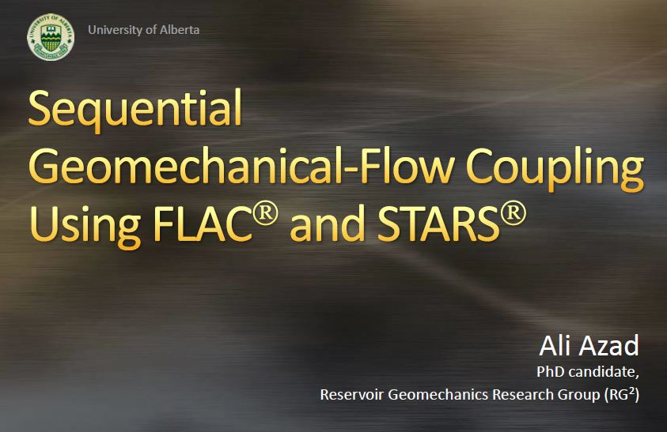

# coupled.simulation
> multiphysics (fluid mechanics + solid mechanics) coupled simulation

### Simulation
This dataset facilitates multi-physics simulation and creat a coupled model in one run. The algorithm used multiple .exe files to run numerical portion of simulation. The flow of data is managed in Linux (RUN) and embedded scripts in each step.

### Need Help?
* [slides](guide_ver1.2.pdf) of a presentation that discusses the structure behind this simulation.
* Read the [paper](https://www.onepetro.org/conference-paper/ARMA-11-414) resulted from this work.

### Abstract
Steam Assisted Gravity Drainage (SAGD) process has been successfully employed for unconventional oil sand reservoirs in Canada. In this process, two horizontal boreholes are drilled one on top of the other at the bottom of a reservoir. Steam is injected through the top borehole and oil is produced from the bottom borehole. Beside the flow process, geomechanical processes are also active and can play a role in SAGD. It has been shown that porosity and permeability are the two major rock properties that are highly influenced by geomechanical behavior of oil sand during a thermal recovery process. This paper investigates the SAGD process numerically when geomechanics is considered. For this reason, a code was developed to couple a flow simulator and a geomechanical module based on iterative coupling approach for different 2D models. Results confirm that oil production is improved when geomechanics is involved in simulation and the impact of geomechanics on each case is explored. The results have been also compared to the analytical models and a geomechanical impact factor (GIF) is introduced for uncoupled simulations.

